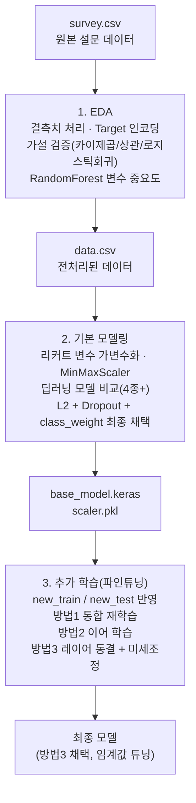

# 항공 고객 만족도 예측을 통한 서비스 개선

설문 기반 항공 고객 만족도 데이터를 분석하여 만족도에 영향을 미치는 핵심 요인을 찾아내고, 이를 예측하는 딥러닝 모델을 구축한 뒤 신규 데이터로 지속적으로 성능을 개선하는 미니 프로젝트입니다. (KT AIVLE School AI 트랙 미니 프로젝트 1)

## 프로젝트 소개

항공사는 고객경험을 핵심 가치로 내세우며 기내 서비스 전반에 걸쳐 만족도 설문을 수집합니다. 그러나 설문 응답만으로는 다음과 같은 현실을 설명하기 어렵습니다.

- 설문상 만족도 평가는 대체로 긍정적이지만, 실제로는 고객 불만 접수와 공항 현장 서비스 불만, 온라인 부정 후기가 함께 늘어나는 경우가 있습니다.
- 서비스 항목이 20개가 넘어 어떤 항목을 우선 개선해야 실제 만족도에 가장 큰 영향을 주는지 판단하기 어렵습니다.
- 시간이 지나면서 신규 설문 데이터가 계속 들어오는데, 기존 모델을 매번 처음부터 다시 학습시키는 것은 비효율적입니다.

이 프로젝트는 위 문제를 데이터 분석과 머신러닝/딥러닝으로 풀어보는 것을 목표로 합니다. 탐색적 분석으로 만족도와 실제로 유의미한 관계가 있는 변수를 통계적으로 검증하고, 그 변수들을 바탕으로 만족/불만족을 예측하는 딥러닝 모델을 만든 뒤, 새로 수집되는 데이터에 기존 모델을 어떻게 적용하는 것이 가장 효율적인지(재학습 / 이어학습 / 미세조정)까지 비교합니다.

## 데이터 설명

원본 데이터는 `data/survey.csv` (19,278행)이며, 승객 1인당 아래와 같은 정보를 담고 있습니다.

| 구분 | 컬럼 | 설명 |
|---|---|---|
| 인적 정보 | Gender, Customer Type, Age | 성별, 고객 유형(신규/충성고객), 나이 |
| 여행 정보 | Type of Travel, Class, Flight Distance | 여행 목적(개인/업무), 좌석 등급, 비행 거리 |
| 서비스 만족도 (0~5 리커트) | Inflight wifi service, Departure/Arrival time convenient, Ease of Online booking, Gate location, Food and drink, Online boarding, Seat comfort, Inflight entertainment, On-board service, Leg room service, Baggage handling, Checkin service, Inflight service, Cleanliness | 14개 세부 서비스 항목별 만족도 점수 (0점은 '해당 없음'을 포함할 수 있음) |
| 운항 정보 | Departure Delay in Minutes, Arrival Delay in Minutes | 출발/도착 지연 시간(분) |
| Target | Satisfaction | Satisfied / Neutral or Dissatisfied |

Target 비율은 불균형합니다. 만족(Satisfied) 고객 수가 불만족·보통 고객 수보다 훨씬 많아, 모델링 단계에서 클래스 가중치 보정이 필요했습니다.

이후 서비스 운영 중 추가로 수집된 데이터가 `data/new_train.csv`(850행), `data/new_test.csv`(350행)이며, 기존에 학습한 모델을 이 신규 데이터에 어떻게 적용할지가 3단계(파인튜닝)의 주제입니다.

## 접근 방법 / 파이프라인



### 1단계. 탐색적 데이터 분석 (`notebooks/01_eda.ipynb`, `src/eda.py`)

- 결측치: 수치형(Age, Arrival Delay in Minutes)은 중앙값, 범주형(Inflight wifi service, Seat comfort, Food and drink)은 최빈값으로 대체
- Target을 Satisfied=1 / Neutral or Dissatisfied=0 으로 변환하고, 분석에 의미 없는 Unnamed: 0, ID 컬럼 제거
- 가설 5개를 세우고 단변량/이변량 시각화와 통계 검정으로 검증
  - Inflight wifi service ↔ Satisfaction: 카이제곱 검정 결과 **Chi2 = 1520.53, p < 0.001**
  - Online boarding ↔ Satisfaction: 점2렬 상관계수 **r = 0.332, p < 0.001**
  - Ease of Online booking ↔ Satisfaction: **Chi2 = 667.89, p < 0.001**
  - Class ↔ Satisfaction: 로지스틱 회귀(GLM) 결과 좌석 등급 계수 **-1.3517 (p < 0.001)** — 등급이 낮을수록(Eco 방향) 만족 로그오즈가 유의하게 낮아짐
- RandomForest로 변수 중요도를 확인한 결과(라벨 인코딩 후 전체 데이터 기준, 검증 정확도 0.97), 상위 변수는 **Inflight wifi service, Online boarding, Type of Travel, Ease of Online booking, Class** 순
- 35세를 기준으로 데이터를 분리해 연령대별 모델을 각각 만들어본 결과, 두 그룹 모두 온라인 서비스·기내 와이파이가 핵심 변수였으나 35세 이하는 온라인 예약·탑승 수속, 35세 초과는 다리 공간 서비스(Leg room service)가 상대적으로 더 중요하게 나타남
- 전처리된 결과를 `data/data.csv`로 저장

### 2단계. 기본 모델링 (`notebooks/02_modeling.ipynb`, `src/modeling.py`)

- 0~5 리커트 척도의 14개 서비스 항목은 순서 간 간격이 동일하지 않고 0점이 '해당 없음'을 의미할 수 있어, 그대로 수치로 쓰지 않고 **가변수화(One-Hot Encoding)** 처리
- MinMaxScaler로 스케일링 후 학습:검증을 8:2로 분리
- Baseline(은닉층 없음) → 은닉층 5개 모델 → Dropout 모델 → EarlyStopping 모델까지 4개 이상의 아키텍처를 비교했으며, 그 과정에서 EarlyStopping을 적용한 모델이 오히려 학습이 조기 종료되며 정확도 0.49까지 떨어지는 실패 사례도 확인
- 위 모델들은 모두 불만족(0) 클래스 재현율이 낮다는 공통 한계가 있어, 최종적으로 **L2 정규화(0.001) + Dropout(0.4/0.3) + class_weight(balanced) + Adam(lr=0.005) + EarlyStopping(restore_best_weights)** 조합의 모델을 채택
- 최종 채택 모델을 `models/base_model.keras`, 스케일러를 `models/scaler.pkl`로 저장

### 3단계. 모델 추가 학습 / 파인튜닝 (`notebooks/03_finetuning.ipynb`, `src/finetuning.py`)

- 신규로 수집된 `new_train.csv` / `new_test.csv`에 기존 전처리 로직을 그대로 재사용할 수 있도록 `build_model_input()` 파이프라인 함수로 정리(결측치 처리 → Target 인코딩 → 컬럼 정리 → 라벨 인코딩 → 가변수화 → 스케일러 컬럼 정렬 → 스케일링)
- 신규 평가 데이터(new_test)에 기존 base_model을 그대로 적용해 성능을 먼저 확인한 뒤, 세 가지 갱신 전략을 비교
  1. **방법 1 — 통합 재학습**: 원본 데이터 + 신규 데이터를 모두 합쳐 동일 구조 모델을 처음부터 재학습
  2. **방법 2 — 이어 학습**: 기존 base_model을 신규 학습 데이터만으로 이어서 추가 학습
  3. **방법 3 — 레이어 동결 미세조정**: 방법 1의 모델의 앞쪽 레이어를 동결하고 새 출력층만 신규 데이터로 미세조정, 이후 recall 0.9 이상을 만족하는 최적 판정 임계값을 그리드서치로 탐색
- 세 전략을 비교한 결과 **방법 3(레이어 동결 미세조정)**이 가장 균형 잡힌 성능을 보여 최종안으로 채택

## 사용 기술 / 라이브러리

- 데이터 처리 · 시각화: `pandas`, `numpy`, `matplotlib`, `seaborn`
- 통계 검정: `scipy.stats` (chi2_contingency, pointbiserialr, ttest_ind), `statsmodels` (GLM 로지스틱 회귀)
- 머신러닝: `scikit-learn` (RandomForestClassifier, LabelEncoder, MinMaxScaler, train_test_split, classification_report, class_weight)
- 딥러닝: `TensorFlow` / `Keras` (Sequential, Dense, Dropout, L2 Regularizer, Adam, EarlyStopping)
- 모델/스케일러 직렬화: `joblib`

## 결과

수치는 모두 각 노트북에 실제로 출력된 값을 그대로 옮긴 것입니다.

**1단계 — RandomForest (전체 데이터, 검증셋 5,784건)**

| 클래스 | precision | recall | f1-score |
|---|---|---|---|
| 0 (불만족) | 0.90 | 0.79 | 0.84 |
| 1 (만족) | 0.98 | 0.99 | 0.98 |
| accuracy | | | **0.97** |

**2단계 — 최종 채택 딥러닝 모델 (검증셋 3,856건, class_weight 적용)**

| 클래스 | precision | recall | f1-score |
|---|---|---|---|
| 0 (불만족) | 0.59 | 0.88 | 0.71 |
| 1 (만족) | 0.99 | 0.94 | 0.96 |
| accuracy | | | **0.93** |

class_weight 보정 전 모델(불균형 미보정)은 정확도는 0.96으로 더 높았지만 불만족 클래스 재현율이 0.61~0.79에 그쳤습니다. 클래스 가중치를 적용한 이 모델은 전체 정확도를 일부 양보하는 대신 불만족 고객을 놓치지 않는 재현율(0.88)을 확보했습니다.

**3단계 — 신규 데이터(new_test, 350건)에 대한 갱신 전략별 성능**

| 전략 | accuracy | 비고 |
|---|---|---|
| 방법 1: 통합 재학습 | 0.92 | 원본+신규 데이터 전체로 재학습 |
| 방법 2: 이어 학습 | 0.83 | base_model에 신규 데이터만 추가 학습 |
| 방법 3: 레이어 동결 미세조정 (채택) | **0.93** | 판정 임계값 0.63 (recall ≥ 0.9 기준 그리드서치) |

## 프로젝트 구조

```
01-Miniproject/
  README.md
  notebooks/              원본 분석 과정이 담긴 노트북 (백업/참고용)
    01_eda.ipynb
    02_modeling.ipynb
    03_finetuning.ipynb
  src/                     노트북 로직을 정리한 실행 가능한 파이썬 스크립트
    eda.py
    modeling.py
    finetuning.py
  data/
    survey.csv             원본 설문 데이터
    data.csv               1단계에서 전처리된 데이터
    new_train.csv          추가 학습용 신규 데이터
    new_test.csv           추가 평가용 신규 데이터
  models/
    base_model.keras       2단계에서 저장한 기본 모델
    scaler.pkl             2단계에서 학습한 MinMaxScaler
  docs/
    Miniproject_01.pdf      과제 안내 자료
    (AI트랙) 조별 과제 1P_05반 15조.pptx   팀 발표 자료
```

### 실행 방법

노트북(`notebooks/`)은 원래 분석 과정을 그대로 보존한 백업본이며, `src/`의 스크립트는 동일한 로직을 노트북 밖에서도 순서대로 실행할 수 있도록 정리한 버전입니다.

```bash
python src/eda.py          # survey.csv -> data.csv
python src/modeling.py     # data.csv -> models/base_model.keras, models/scaler.pkl
python src/finetuning.py   # base_model.keras + new_train/new_test -> 파인튜닝 비교
```
